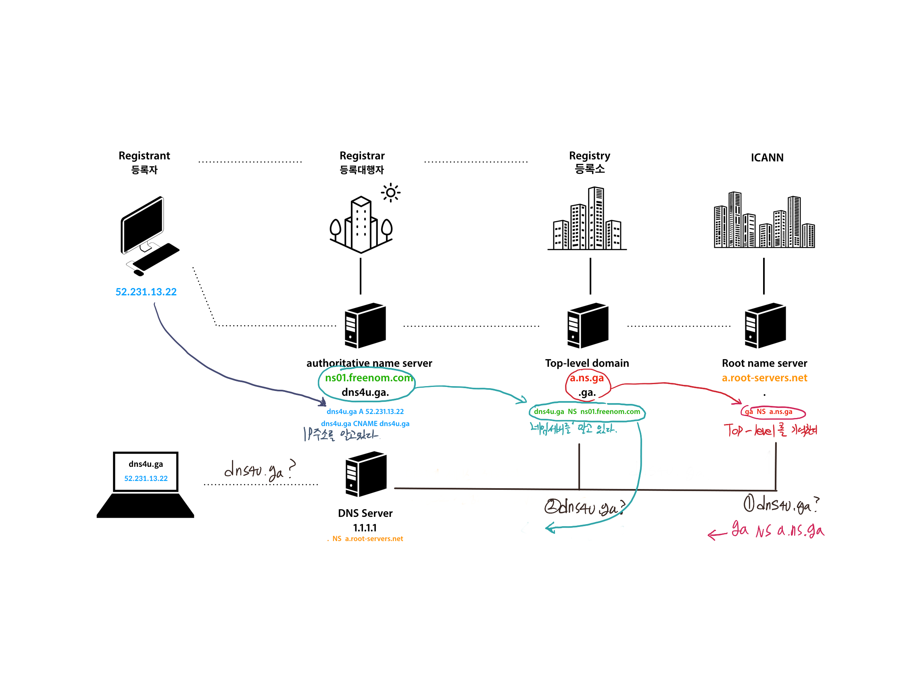

# DNS
구글 등 다양한 사이트에 접속하기 위해서 우리는 보통 google.com같은 url를 입력하고 엔터키를 누른다.
보통 사이트 주소라고도 말하는데 집 주소와 마찬가지로 사이트의 위치를 말해주는 주소이기 때문이다.
그런데 우리는 ip주소로도 위 사이트들을 접속할 수 있다.
그렇다면 두개는 어떤 차이가 있고, 이러한 주소는 어떤 흐름으로 설정하는지 이번 파트에서 간단히 알아보고자 한다.

## DNS 란
DNS를 정의하기 전에 왜 DNS가 나온 이유에 대하여 먼저 알아보려고 한다.
DNS가 어떤 문제를 해결하기 위해 나왔는지를 알게 되면 더 깊게 이해할 수 있을 것이다.

### DNS 이전 연결방식
DNS라는 개념이 없던 시절 클라이언트가 서버에 접속하기 위해서는 ip주소로 접속해야 했다.
그리고 서버 또한 클라이언트의 ip주소를 알아야 했다.
즉 양쪽이 서로 상호작용을 해야하고 이렇게 연결된 컴퓨터,장치들을 host라고 부른다.
그러나 ip주소는 기억하기 힘들기 때문에 간단한 이름이 필요했고, hosts라는 파일에 이름을 등록했었다.
ex)00.000.000.00 example.com

### 보안의 위험성과 https
이러한 hosts 파일의 수정으로 이름을 정하는 것은 보안의 위험성을 가진다.
누군가 악의적으로 hosts 파일을 조작해 이름은 같지만 ip 주소만 바꾸게 된다면 전혀 다른 웹페이지에 접속하게 하고 정보를 훔칠 수 있기 때문이다.
이러한 정보 훔침을 '피싱'이라고 한다.
이러한 피싱은 http보다 보안성이 강화한 https로 접속해 방지를 할 수 있다.
그러니 사이트가 http면 조심하자.

### DNS의 태동
위에서 host의 연결을 다수에게 적용하기 위해 과거에는 'stanford Research Institute'이라는 신뢰할 수 있는 단체에 영업시간에 맞춰서 전화를 해 이렇게 말해야 했다.
"00.000.000.00는  example.com 로 해주세요"
그러면 단체에서 hosts파일 변경하고 클라이언트는 단체에서 hosts 파일을 다운받아서 접속을 했었다.
그러나 이러한 방식은 중간과정에서 비용이 생기고 규모가 커지는 인터넷 상황에 점점 맞지 않았다.
그래서 이 문제를 해결하기 위해 1983년 'Jon Postel'과 'Paul Mockapetris'가 개발한 시스템이 <strong>'Domian name System'이다.</strong>

### DNS??
DNS는 서버 host가 Domain Name System Server에 자신의 ip주소의 이름은 example.com로 하고 싶다고 요청을 한다.
그리고 클라이언트 쪽에서 인터넷에 연결하면 자동적으로 DNS server의 ip를 알게 된다.(무언가 마법같은 방법으로 된다고 한다.)
이후 브라우저로 example.com을 치면 처음에는 hosts 파일에서 확인하고, 없을 시 DNS server에 접속해서 이름을 확인하게 된다.
그러면 DNS server가 ip에 맞는 이름을 알려주게 된다.
이러한 흐름이 바로 Domain Name System 즉 <strong>DNS</strong>라는 것이다.

간단히 말하자면 ip주소를 기억하기 쉽게 특정 도메인네임으로 변한해주는 시스템이라고 할 수 있다.

**출처**
-https://opentutorials.org/course/3276/20299

## 도메인 네임

### 도메인 네임??
위에서 DNS가 무엇인지 간단히 정리를 해봤다.
위에서는 ip를 대신하는 것을 이름이라고 말했는데 사실 이 이름이 도메인 네임이다.
도메인 네임과 ip는 땔래야 땔 수 없는 사이라 먼저 ip가 무엇인지 알아야한다.
- ip란 인터넷에 연결되어 있는 장치들을 각자 가지고 있는 주소로 이 주소로 구별을 할 수 있고 이것을 ip주소라고 한다.
말 그대로 사람의 이름이라고 할 수 있는데 외국 사람들의 풀 네임이라고 생각하면 될 것 같다.
- 도메인 네임은 이러한 ip주소가 기억하기 어렵기 때문에 DNS를 통해서 이름을 부여할 수 있게 됐는데 이 이름이 도메인 네임인 것이다.
풀 네임이 ip라면 도메인네임은 마이크나 존이라고 간단히 부르는 별칭 같은 것이다.

### 도메인 네임의 구조
도메인 네임의 구조를 살펴보기 위해 아래의 이미지를 통해 설명해보려고 한다.

원래 도메인 네임의 끝인 com에는 .이 붙는다고 한다.
아무튼 이렇게 도메인 네임은 .을 기준으로 나눠지게 되는데 뒤에서부터 Root->Top-level->Second-level->sub순이다.
DNS server는 한개가 아니라 아주 많이 존재하는데 이러한 서버들이 서로 도움을 주면서 속도 향상에 힘 쓰고 있다.
그리고 각 server는 순서 중 하나씩을 담당하고 있다.
그래서 만약 클라이언트가 도메인 네임으로 접속을 하게 되면 처음에 Root를 담당하는 server부터 시작해서 com을 담당하는 Top-level server로 안내해주고 이런식으로 sub를 담당하는 server가 ip 주소를 알려주게 된다.

### 도메인 네임 등록
#### DNS를 움직이는 주체들
  - **ICANN**: DNS의 정점 모든 ip주소를 관리하고 RootName Server의 관리자이다.
  - **Registry**: .com, .net 등과 같은 Top level 도메인을 관리한다.
  - **Registar**: 등록대행자 등록자에 ip주소를 Registry에 등록을 해준다.

#### 도메인 네임 등록 하기
  1. 등록자는 자신이 원하는 도메인 네임을 등록해달라고 대행자에게 부탁한다.
  2. 등록대행자는 수수료를 받고 Registry에 등록을 한다.

#### 간단한 이미지 요약
도메인 네임 등록부터 어떠한 원리로 IP를 찾게 되는지에 대한 간단한 이미지 요약이다.

**출처**
https://opentutorials.org/course/3276

## 호스팅
웹은 클라이언트 프로그램과 서버 프로그램을 통해 작동한다.
웹페이지에 명령을 클라이언트가 서버에게 값을 요청하고 서버는 데이터베이스에서 데이터를 찾아 클라이언트에 전달하고,
유저에게 보여준다.
여기서 홈페이지 운영을 위해서는 서버가 꼭 필요한데 이러한 서버는 24시간 내내 열어둬야 하고, 빠르고 안정적인 인터넷 회선과
철저한 보안 시스템을 갖춰야 한다.
그러나 개인이 서버를 관리하기에는 어려움이 많기 때문에 서버의 전체 혹은 일부를 이용할 수 있도록 임대해 주는 서비스를 <strong>호스팅</strong>이라고 한다.

### 호스팅의 종류
이러한 호스팅에는 여러 종류가 있다.
- **웹 호스팅**: 웹 호스팅은 호스팅 업체가 보유한 서버의 일부를 임대해 주는 서비스다.
건물의 사무실을 임대하는 것으로 비유할 수 있다.
웹호스팅은 한대의 서버를 여려명의 사용자가 사용하므로 트랙픽의 제한이 있다.
하지만 비용이 저렴해 일반적인 중소규모의 홈페이지를 운여하기 적당하다.
- **서버 호스팅**: 서버 호스팅은 호스팅업체가 보유한 서버를 단독으로 임대 또는 구매하는 것이다.
건물 전체를 임대하는 것으로 비유할 수 있다.
서버 한대를 독자적으로 사용하기 때문에 서버를 맞춤형으로 사용할 수 있고, 보안상 유리하다.
그러나 그만큼 비용이 크기 때문에 대용량 트래픽, 큰 데이터베이스, 보안이 중요한 큰 홈페이지에서 사용하는 것이 좋다.
- **클라우드 호스팅**: 클라우드 서버 호스팅은 가상의 웹서버를 임대하는 것을 말한다.
아마존의 EC2 또한 클라우드 서버 호스팅이다.
사용자의 필요에 따라 실시간에 가깝게 자유로운 확장과 축소가 가능하다는 장점이 있다.
사용료를 사용한 만큼 지불하는 후불제라는 방식도 위에 두 방식과의 차이다.

## 웹 브라우저에서 google.com을 쳤을때 벌어지는 일
웹 브라우저에서 google.com을 쳤을 때 벌어지는 일을 설명하기 전 간단히 알아야 할 내용들이 있다.

- **TCP/IP**: Transmission Control Protocol(전송 제어 규약)과 Internet Protocol(인터넷 규약)은 데이터가 어떻게 웹을 건너 움직이는지 정의한 통신 규약이다.
- **DNS**: DNS는 위에서 설명을 했다.
- **HTTP**: Hypertext Transfer Protocol(하이퍼텍스트 전송 규약)은 클라이언트와 서버가 서로 통신을 할 수 있게 하기 위한 언어를 정의하는 어플리케이션 규칙이다.
- **컴포넌트 파일**: 웹 사이트는 두개의 주요한 타입이 있다.
  - **코드 파일**: 웹 사이트는 근본적으로 HTML, CSS, JavaScript 등으로 구성된다.
  - **자원**: 이미지, 음악, 비디오, 단어 문서 등 웹사이트를 만드는 다른 모든 것들을 위한 공동적인 이름이다.

### 웹 브라우저에서 google.com을 쳤을때 벌어지는 일을 정리하면 아래와 같다.

1. 주소 표시줄에 URL을 입력하고 Enter를 입력한다.

2. 웹 브라우저는 DNS 서버로 가서 웹사이트가 있는 서버의 진짜 주소를 찾는다.
  - 브라우저는 도메인이 캐시에 들어있는지 먼저 확인한다.
  - 만약 Browser Cache에서 못 찾으면 OS에 저장된 DNS Cahche를 찾게 된다.
  - 만약 OS Cache에서도 못 찾으면 Router DNS Server에 직접 조회를 진행한다.
  - 위에서도 찾지 못한다면 Root DNS부터 조회를 해 결과를 가져온다.
  

3. 브라우저는 서버에게 웹사이트의 사본을 클라이언트에게 보내달라는 HTTP 요청 메세지를 서버로 전송한다.
이러한 메세지와 클라이언트와 서버 사이에 전송된 모든 데이터는 TCP/IP 연결을 통해서 전송된다.
  - Server의 IP주소로 TCP Socket을 열어 Server와 통신 준비를 진행한다.
  - TCP는 장치들 사이에 논리적인 접속을 성립하기 위해 three-way handshake를 사용한다.
  - TCP Socket을 통해 HTTP Protocol로 원하는 Resource를 요청한다.
  
4. 메세지를 받은 서버는 클라이언트의 요청을 승인하고 응답을 클라이언트에게 전송한다.
그리고 웹사이트의 파일들을 데이터 패킷이라 불리는 작은 일련의 덩어리들로 브라우저에 전송하기 시작한다.

  [HTTP 요청과 관련된 글] https://d2.naver.com/helloworld/59361
  

5. 브라우저는 이 작은 덩어리들을 완전한 웹 사이트로 조립하고 우리는 google 사이트를 볼 수가 있게 된다.[자세한 링크]https://d2.naver.com/helloworld/59361

**출처**
https://nesoy.github.io/articles/2018-06/What-happens-search-google
https://developer.mozilla.org/ko/docs/Learn/Getting_started_with_the_web/%EC%9B%B9%EC%9D%98_%EB%8F%99%EC%9E%91_%EB%B0%A9%EC%8B%9D